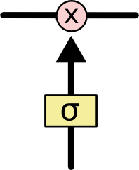

博客翻译 - 理解LSTM

----

## 理解LSTM

#### RNN

​	人类的思考并不是每一秒都要从头开始的。实际上，在你读这篇博客的时候，理解每一个词语的时候，你都用到了之前所获取到的词语。也就是说，人类的思维是持续性的。

​	但是传统的神经网络并不是，这是它们的一个短板。举个栗子，假如你正在为某部电影的每一个时间点的事件进行分类，传统的神经网络并不能使用前面已经分类好的事件去为之后面的事件提供参考。

​	循环神经网络(Recurrent neural network, RNN)解决了这个问题，RNN的网络中存在环，这使得信息能够存留。

循环神经网络：存在环

​	可以看到，上图中是循环神经网络的一小部分A，它的输入是$$x_t$$，输出是$$h_t$$. 图中的环使得信息能够从时序上的前一步到达后一步。

​	这些环使得RNN看起来有些难以理解。但其实如果你深入思考一下，RNN与普通的神经网络并没有很大的区别。RNN的单元可以被理解为多个神经元的复制，每一个复制品都把自己的信息传递给下一个复制品。我们把循环神经元展开如下：

展开的RNN神经元

​	以上链式特点表明它和序列/列表紧密相连——它能让神经网络处理这类数据。

​	不仅能，而且已经被广泛地成功地应用。在过去的几年里，RNN被成功地应用，解决了许多问题：语音识别、语言建模、翻译、为图片配字幕等等，而且应用广度还在迅速增长。想了解RNN究竟由哪些神奇的特点，可以参考Andrej Karpathy的博客< [The Unreasonable Effectiveness of Recurrent Neural Networks](http://karpathy.github.io/2015/05/21/rnn-effectiveness/)>.我这里不在赘述——但这些特点真的是很神奇。

​	这些成功的关键，在于使用了"LSTM"，一种非常特点的RNN，它可以被用于许多任务,而且比原版的RNN效果好非常非常多。几乎所有的RNN相关的成就都是通过LSTM来完成的。本文的中心就是探索它——LSTM。

#### 长期依赖(Long-Term Dependencies)问题

​	RNN的有吸引力的特点之一便是它可能把过去的信息用于现在的任务，比如使用过去的视频帧来理解当下的视频帧。如果RNN能实现这一点，那么它就非常有用。但它可以吗？看情况。

​	有时，我们只需要最近的信息来解决当下的任务。比如在语言建模任务中，我们尝试根据先前的若干词预测下一个词。如果我们尝试预测 “the clouds are in the *sky*” 中的最后一个词，我们并不需要更先前的上下文——很明显最后一个词应该是"sky"。在这种情况下，过去的依赖信息和这些信息被用到的地方相距不远，RNN可以使用这些过去的信息。

​	但有些情况下，我们需要更多的上下文。还是考虑“预测最后一个词”的情况：“I grew up in France... I speak fluent *French*.”临近的信息可以推测出下一个词很可能是一种语言名称，但如果你想知道是哪种语言，我们就需要更早的上下文中的“France”。这种相关依赖的位置距离我们预测位置很远的情况并不少见。

​	但不幸的是，随着这一距离的增加，RNN变得很难去连接这些信息。

​	理论上，RNN是完全可以搞定这些长期依赖的。我们可以为RNN仔细挑选参数来解决这一问题。但实际上，RNN 并不能学到这些长期依赖。 [Hochreiter (1991) [German\]](http://people.idsia.ch/~juergen/SeppHochreiter1991ThesisAdvisorSchmidhuber.pdf) 和[Bengio, et al. (1994)](http://www-dsi.ing.unifi.it/~paolo/ps/tnn-94-gradient.pdf) 深入研究并找到了为什么RNN不能解决这一问题的一些根本原因。

​	但谢天谢地，LSTM没有这个问题。

#### LSTM网络

​	长短期记忆网络(Long Short Term Memory Networks, LSTMs)是一种特别的RNN，它能够学到长期依赖。LSTM被[Hochreiter & Schmidhuber (1997)](http://www.bioinf.jku.at/publications/older/2604.pdf)提出，接下来被许多人完善，并越来越出名。LSTM解决很多问题都非常成功，如今已被广泛使用。

​	LSTM就是被设计来解决长期依赖问题的，记忆长期信息正是它所擅长的。

​	所有的RNN结构都是链式地重复神经元模块。在标准的RNN中，这些重复的模块的结构非常简单，例如一个简单的tanh层。

RNN中只包含单一层的重复模块

​	LSTM的结构也是链式结构，但是组成链式结构的重复模块的结构与标准RNN不同，LSTM的模块不再由一个简单的神经网络层构成，而是由4个以特殊形式交互的神经元构成。

LSTM的重复模块包含4个相互交互的层

​	先不用急着理解LSTM的细节，我们会一步一步把它扒个干净。现在，我们只需要先了解一下几个会用到的符号。

​	在上图中，每条线都输运一个向量(vector)，从一个节点(node)的输出到另一些节点的输入。分红的圆圈代表逐点的操作，比如向量的加法，黄色方形代表学出的神经网络层。线的汇集代表拼接，线的分叉代表其内容被拷贝，又被输运到了不同的位置。

#### LSTM的核心思想

LSTM的关键在于the cell state，即下图中穿越图片顶部的那条线。

the cell state有点像一条传送带。它贯穿整个链式结构，仅有一些线性的交互。信息可以通过它传送，并保持不变。

LSTM不能从the cell state中添加或者删除信息，这一点由名为gate的结构来保证。

gates是一种信息选择性通过机制。它们由一个sigmoid神经网络层和一个点乘操作构成。

sigmoid层输出在0到1之间，决定了每个成分(component)通过的百分比。取0代表任何信号不得通过，取1代表所有信号都可以通过。

LSTM有三个门，来保护和控制the cell state.

#### LSTM漫游

LSTM的第一步是决定从the cell state中丢弃什么信息。这一决定是由叫做"forget gate layer"的sigmoid层作出的。它根据$$h_{t-1}$$和$$x_t$$，为the cell state $$c_{t-1}$$中的每一个数输出一个0到1之间的数字。1代表“完全保留”，0代表“完全丢弃”。

让我们再次考虑语言模型的例子：我们希望通过所有之前的词语来预测下一个词语。在这种问题中，the cell state可能包含了当前主体的性别信息，所以我们可以预测使用正确的代词。当我们看到了一个新的主体时，我们就希望忘掉之前主体的性别信息。

第二步决定向the cell state中存储哪些新信息。这分为两部分。第一，一个叫做"input gate layer"的sigmoid层决定我们更新哪些值；然后一个tanh层创建一个包含将被添加到cell state的候选值的向量， $$\tilde{C}_t$$。在下一步中，我们将把这两部分合并，创建一个更新。

在语言模型的例子中，我们希望向cell state增添新主体的性别信息，来替换旧的主体的性别信息。

现在我们就可以把旧的cell state，$$\tilde{C}_{t-1}$$，更新为新的cell state，$$\tilde{C}_t$$了。

我们把旧state乘以$$f_t$$,忘掉那些我们希望忘掉的信息。然后我们加上$$i_t*\tilde{C}_t$$.这就是用于更新每个state值的候选值，并且缩放了我们想要的倍数。

在语言模型的例子中，这里就是我们我们丢弃旧主体的性别信息然后加上新的信息的位置。

#### LSTM的变体

### 总结

### 致谢

